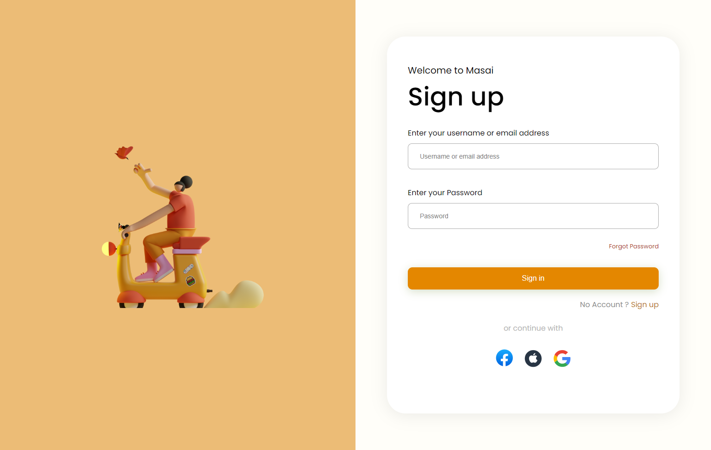

# Figma Signup Form

This project is a signup form designed using Figma and implemented using HTML and CSS. The signup form provides a user-friendly interface for capturing user information during the registration process.

## Features

- User-friendly and visually appealing signup form design.
- Input fields for capturing user information such as name or email, and password.

## Tech Stack

- HTML
- CSS

## Usage

To use this project, follow these steps:

1. Clone the repository:

```bash
git clone https://github.com/Arbaz86/Figma_Sign_up_form.git
```

2. Open the project directory.
3. Open the index.html file in a web browser to view the signup form.

## Preview


